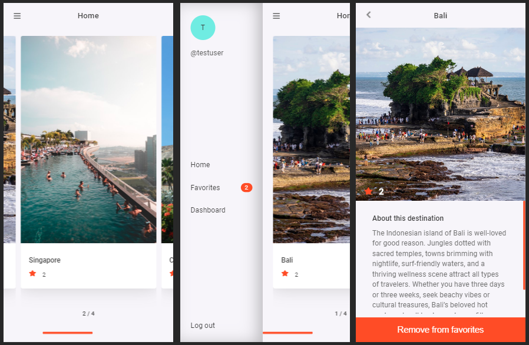

# Next Destination (Front-End)

Next Destination is an app that allows you to browse through the world's top touristic destinations and lets you save them for future reference. An admin user can create, update, and delete destinations.

This is the front-end part of the Next Destination application. This mobile web app is connected to a [Rails API you can find here](https://github.com/sebGilR/next_destination).

## Live Demo

- [View Live Demo](https://feature-app.d1cjah403cwq78.amplifyapp.com/)
- Log in with the user "testuser" and password "nextdestdemo" to test the app, or sign up for a new user.

## Screenshot

## Features & Usage

- The user is first presented with a login screen, or the option to sign up at the bottom.
- A username, password, and password confirmation are required for signing up.
- To log in the user must log in with username and password.
- A list of destinations is presented in a slider.
- The user can navigate the slider by using the mouse wheel to scroll or manually moving the scroll bar.
- Each destination will be centered automatically to facilitate navigation.
- The user can see the name of each destination and the number of times it was marked as favorited, from the home page.
- When clicking the menu icon a menu opens and the user can access their favorites, the dashboard if it is an admin, or return to the home page.
- In the favorites page, the user gets a list of destinations marked as favorite, and the possibility to remove them from their favorites.
- An admin user can visit the dashboard to create new destinations, update their information, or delete them from the database.
- The user can log out by clicking the "Log out" button in the menu.

## Potential Features

- Add desktop specific styles for better responsiveness.
- Allow the admin user to manage other user accounts.
- Add more detailed sections for each destination details page.
- Connect to an API to find reservations for each destination.

## Setup

1. Clone this repository and access the project's directory.
2. Update the endpoint BASE url in src/services/endpoint.js with localhost:4000.
3. Run "npm install".
4. Run "npm test" to run the tests.
5. Run "npm start" to work on the development server.

## Built With

- JavaScript/ES6
- Jest
- React
- React Hooks
- React Router
- Redux
- React Redux
- AWS Amplify

## Author

👤 **Sebastian Gil Rodriguez**

- Website: [sebgil.me](https://sebgil.me)
- Github: [@sebGilR](https://github.com/sebGilR)
- Twitter: [@sebGilR](https://twitter.com/sebGilR)
- Linkedin: [sebastiangilrodriguez](https://www.linkedin.com/in/sebastiangilrodriguez)

## 🤝 Contributing

Contributions, issues, and feature requests are welcome!

Feel free to check the [issues page](https://github.com/sebGilR/next_destination_fe/issues).

## Show your support

Give a ⭐️ if you like this project!

## Acknowledgments

Design idea by [Alexey Savitskiy on Behance](https://www.behance.net/alexey_savitskiy)
